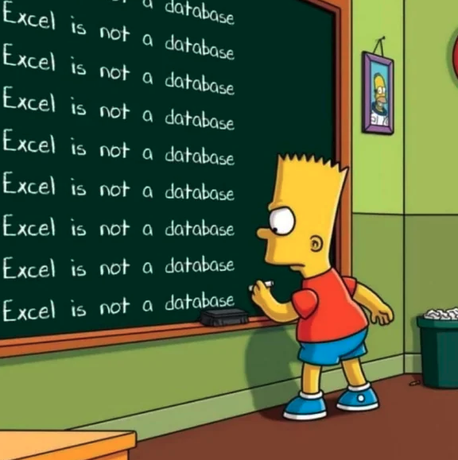

  
  <h3>Всё о базах данных</h3>

В этом репозитории я собираю конспекты, вопросы с собеседований и прочие полезные материалы по вопросам базы данных.

---

## Содержание

1. Теория SQL
    - [Основнаые понятия СУБД (определение, классификация, теорема CAP)](notes/part_1.md)
    - [Классификация баз данных](notes/part_2.md)
    - [Состав баз данных]

2. Реляционные базы данных
    - [Основные понятия реляционной модели (ключи, типы данных, миграции)](notes/part_r1.md)
    - [DML: select, insert, update, delete](notes/part_r2.md)
    - [JOIN, UNION](notes/part_r3.md)
    - [CTE, подзапросы, временные таблицы и табличные переменные](notes/part_r4.md)

    - ...
    - [Вопросы к собеседованию](notes/part_x.md)

2. Задачи sqlex.ru    
    - [схемы](sqlex.ru/schemas.md)
    - [задания 1-19](sqlex.ru/tasks1-19.sql)
    - [задания 20-30](sqlex.ru/tasks20-39.sql)