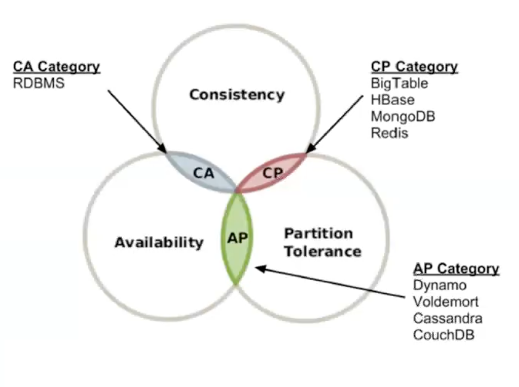

# СУБД

## Что такое СУБД

_**СУБД** (система управления базами данных)_ - совокупность программных и лингвистических средств общего или специального назначения, обеспечивающих управление созданием и использованием баз данных.

_**База данных**_ - это взаимосвязанная информация об объектах, которая организована специальным образом и храниться на
каком-то носителе.

Необходимы для решения следующих проблем (помимо хранения данных):
- производительность
- многопользовательский/конкурентный доступ
- резервное копирование 
- восстановление после сбоев (crush recovery)
- security access control - часть данных скрыто/недоступно к изменению

## Основные компоненты сервера БД

- пользователи и роли
- пользовательские таблицы, индексы, статистики
- представления (view)
- хранимые процедуры и функции
- синонимы
- JOB'ы
- Linked Server
- Очереди
- Репликация/Always On

## Основные термины:

**OLTP** - On-Line Transaction Processing - характер нагрузки на систему, с большим количеством коротких транзакций, 
обычно на внесение данных в систему, например, платежи от клиентов  
**OLAP** - On-Line Analytical Processing - характер нагрузки, с длинными ресурсоемкими транзакциями, много долгих 
запросов на чтение, редкие на запись/изменение данных, например, хранилища данных, отчеты систему  
**MVCC** - MultiVersion Concurrency Control - принцип устранения конфликтов между различными транзакциями через создание 
различных версий одних и тех же данных (оптимистичный сценарий разрешения блокировок)  
**Tempdb** - система БД в SQL Server, которая используется для хранения временных таблиц, табличных переменных, курсоров, иногда работы с hash join, промежуточные результаты сортировки  

## Теорема распределенных систем 

_**CAP** - Consistency Availability Partition tolerance -_ САР система говорит о том, что нельзя совместить все 3 
свойства в одной системе.

  
  

  

  

 
   

[>>> Назад <<<](../README.md)