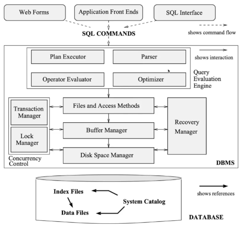
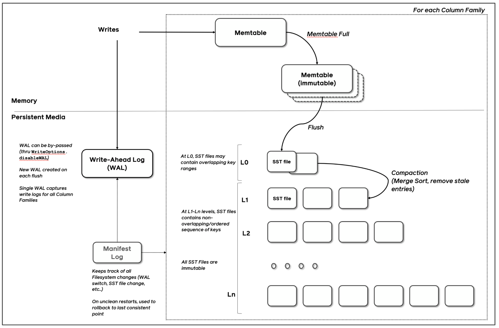
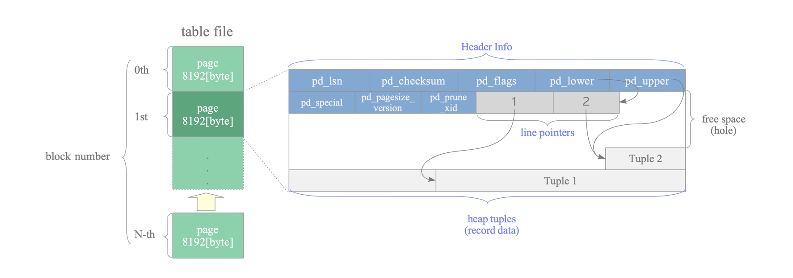
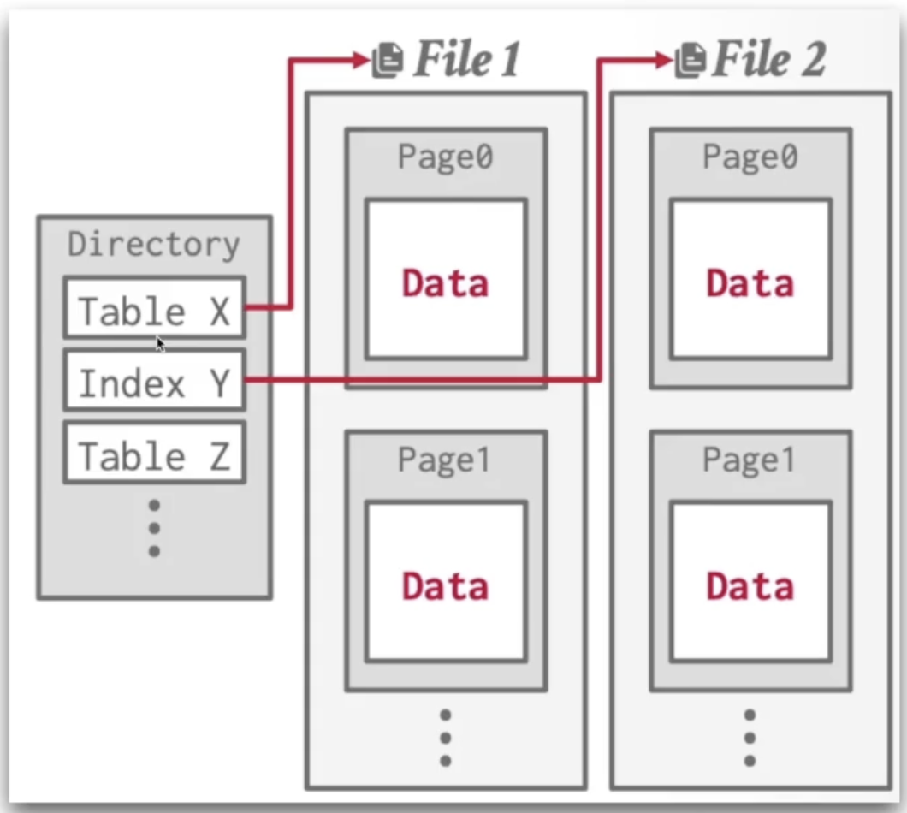
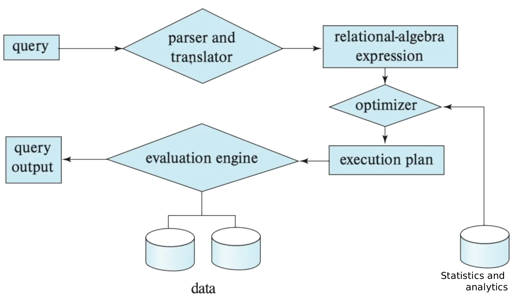
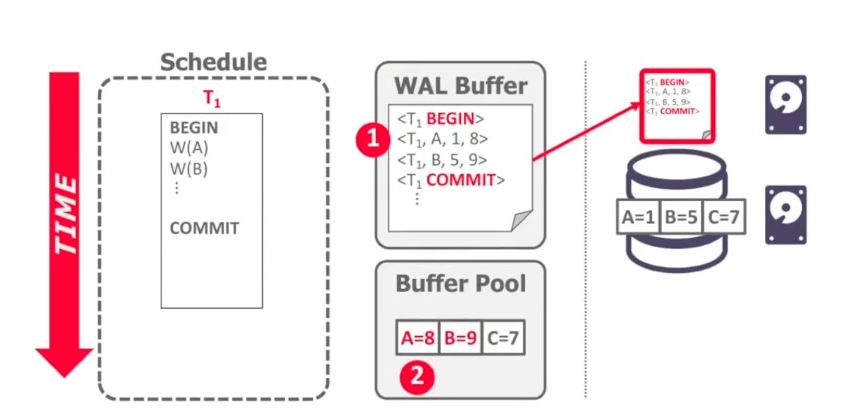
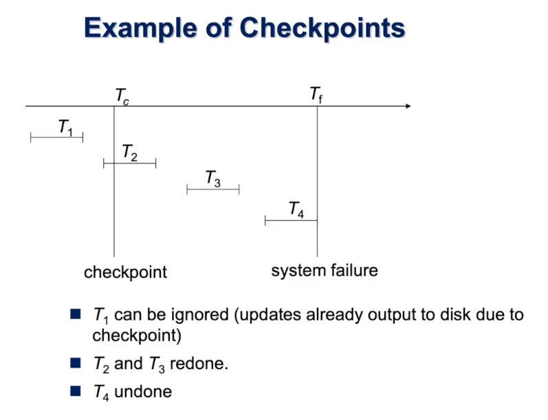

# Компоненты БД

## Классическая реляционная БД

## Колоночная (NoSQL) БД

Другой тип хранения данных - это LSM (Log-Structured Merge tree).

## Storage

[Подробнее ссылка](https://www.interdb.jp/pg/pgsql01/03.html)

Внутри файла данных (таблицы, индекс, карта свободного места и карта видимости) он разделен на страницы фиксированной длины, которая по умолчанию составляет 8 КБ. Страницы внутри каждого файла пронумерованы последовательно, начиная с 0, и эти номера называются номерами блоков. Если файл заполнен, PostgreSQL добавляет новую пустую страницу в конец файла, чтобы увеличить его размер.

**Vacuum** - условный garbage collector для данных, который убирает неиспользованные данные.  

## System Catalog 

Директория, которая хранит мета-данные о данных в бд.

## Buffer pool 

Выполняет функции кэша, а  так же разные утилитарные методы для ускорения работы БД.  

##  Index

**Кластеризованный** - индекс диктует в каком порядке будут хранятся данные в файлы.

**Некластерный**

Индекс может быть **плотный** (dense) и **разряженный** (sparse). Плотный хранит запись 1 к 1. Разряженный - диапазоны.  

Популярные индексы:
- hash индекс
- b+ tree
- bitmap индекс
- инвертированный индекс
- embedibgs
- r tree

## Query plan

## Recovery manager

### Steal policy

Steal / No steal - разрешает "грязные" (содержащие ненужную информацию) пэйджи записывать на диск.

Плюс: можем освободить место в buffer pool.   
Минус: просачивается ненужная информация - незакоммиченные транзакции и пр.  

### Force policy

Force policy - все изменения перенесены на диск
No force policy - изменения на диск не перенесены, но информации достаточно, чтобы записи восстановить.  

### WAL (write ahead log)

Это журнал операций.

WAL состоит из TransactionID, Object ID, Before Value / After Value, Timestamp, Checksum.

Чтобы в случае падения не читать весь WAL и не накатывать всё с самого начала, используются checkpoint'ы.   

