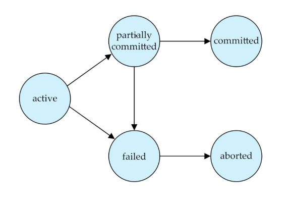
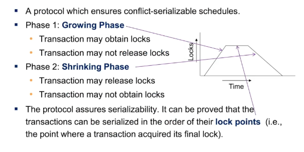
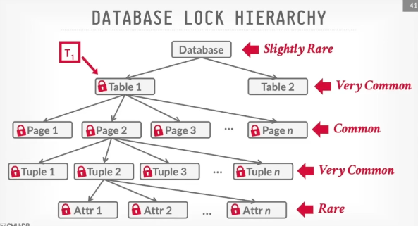

# Транзакции

## Принцип ACID

1. **Atomicity - атомарность**  
  Транзакция будет выполнена полностью или не будет выполнена совсем

2. **Consistency - согласованность**  
  Каждая успешная транзакция фиксирует только допустимые результаты  

3. **Isolation - Изолированность**  
  Во время выполнения транзакции параллельные транзакции не должны  оказывать влияние на результат  

4. **Durability - Надежность**  
  Если пользователь получил подтверждение, что транзакция выполнена, то можно быть уверенным, что изменения не будут отменены из-за какого-либо сбоя.

## Жизненный цикл транзакции   

## Проблемы конкурентности в DBMS:
1. Read Write -> inconsitent read - транзакция читает одни и теже данные, но данные меняют между чтениями
2. Write Read -> dirty read - транзакция читает незакомиченные данные другой транзакции
3. Write Write -> lost update - две транзакции апдейтят одни и те же данные

## Schedule

Schedule - это механизм, который показывает как будут выполняться транзакции в хронологическом порядке  

Schedule должен быть **serializable**, т.е. результат равен результату транзакций, выполненных последовательно, без перекрытия по времени. 

**Критерии конкурентности:**  
1. Conflict serializability - проверяет, может ли расписание транзакций быть трансформировано в последовательно выполняемое и приведет к тому же конечному состоянию базы данных, что и последовательное выполнение.
2. View serializability - проверяет, что параллельное выполнение транзакций приведет к тому же конечному состоянию базы данных, что и последовательное выполнение. 

Schedule должен быть **recoverable**, т.е. в случае ошибки, БД сможет сохранить консистентное состояние и будет восстановлено.

### Concurrency control 

1. Pessimistic подход базируется на том, что конфликт между транзакциями вероятны, поэтому нужно использовать блокировки для их предотвращения

    Validate -> Read -> Compute -> Write

    - Two-phase locking protocol

    

    - Timestamp-Based concurrency control

2. Optimistic подход основан на предположении, что конфликты транзакций редкие и в случае их возникновения, транзакции откатываются (MVCC)

    Read -> Compute -> Validate -> Write

### Deadlocks

1. Wait-Die  

Старая транзакция ждет молодую  
Молодая трназакция прибивается  

2. Wound-Wait

Старая транзакция прибивает молодую  
Молодая транзакция ждет старую  

### Multi-Version Concurrency control (MVCC)

Писатели не блокируют читателей  
Читатели не блокируют писателей  