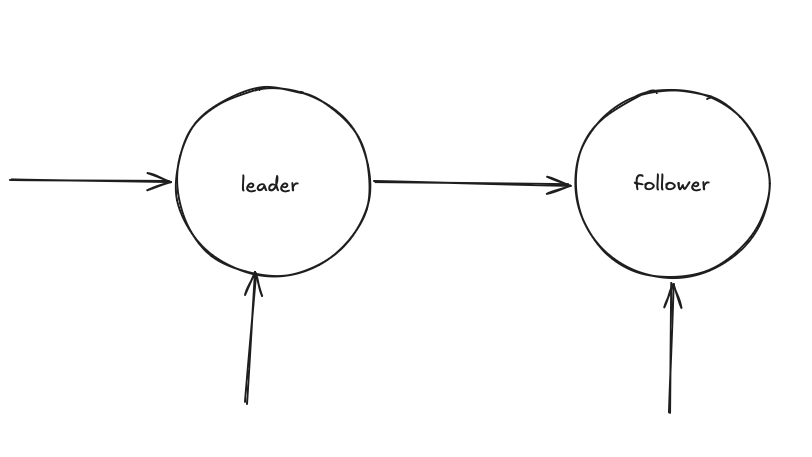
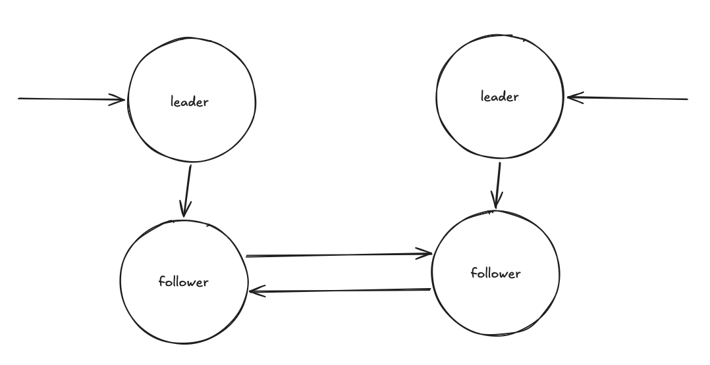
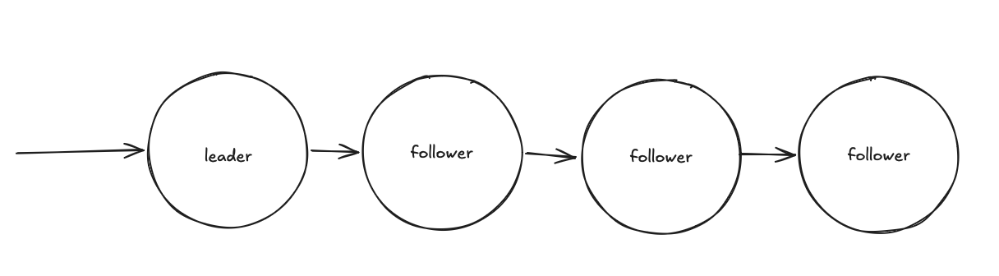
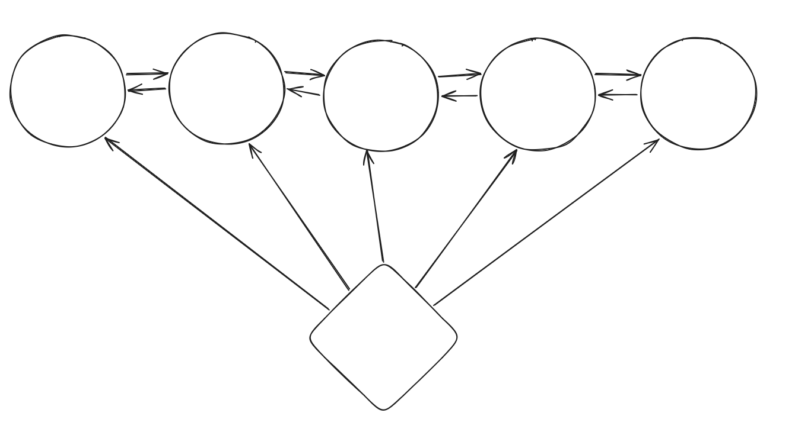

# Репликация

Зачем нужна репликация?

1. Availability - в случае потери данных на одной ноде, всегда есть копия
2. Scalability - распределение нагрузки на чтение
3. Geo - расположение данных ближе к пользователям

## Классификация 

**Синхронная репликация** - ждем, когда синхрониззация осуществиться между лидером и фолловером. Наши данные сохранились, если мы окнули. В этом случае страдает перфоманс. 

**Асинхронная** - это когда мы пишем в лидера, а в фолловера запишем позже. Eventual Consistency. Данные могут разъехаться или вообще не скопироваться.

Еще могут быть:

**Физическая репликация** - когда копируем байты данных с одной машины на другую

**Логическая репликация** - передают SQL statements. 

## Crash'ы

### Если пропал фолловер

New follower -> Replay LOG (WAL) -> может быть большой, тогда берем Snapshot (Dump) -> получаем LSN (Log sequence number) -> синхронизируемся с лидером -> восстановление данных

### Если пропал лидер

follower -> promote new leader (election/consensus) -> если старый лидер появится, то в какой-то момент времени произойдет write discard всех его записей

Если старый лидер пропал на время - Split brain

## Топология

1. Single leader

2. Multi active 

3. Chain 

4. Leader-less

## Метрики для репликаций

1. Replication lag - на сколько отстают версии
2. Replication latency - как долго проходит между записью на реплику (ms)

## Теорема распределенных систем 

_**CAP** - Consistency Availability Partition tolerance -_ САР система говорит о том, что нельзя совместить все 3 свойства в одной системе.

CP - банковская система. Потеря данных важнее, чем недоступность (банковская система)

CA - доступность важнее, чем согласованность (комментарии в чате)

  
  

  

  

## Модели согласованности в распределенных системах

1. Linearizability - модель, которая гарантирует, что любая операция чтения вернет самое последнее записанное значение, а вся система ведет себя так, как будто существует только одна копия данных, обновляемая мгновенно. 

2. Eventual Consisstency - модель, гарантирующая, что если в систему не вносятся новые обновления, то через некоторое время все реплики придут к одному и тому же состоянию.

3. RYW (Read Your Own Writes) - модель, гарантирующая, что если клиент обновил данные, то при последующем чтении он сразу увидит эти изменения. Предотвращает исчезновение данных из-за задержки репликации.

4. Monotonic Read - модель, обеспечивающая, что если клиент прочитал значение данных, то все последующие чтения вернут то же самое или более новое значение.  
    Например, комментарии.

5. Causal Consistency - модель, гарантирующа, что операции, связанные причинно следственной связью, видны всем узлам в одинаковом порядке.   
    Например, ответ на комментарий. Их нельзя поменять местами. Цепочка событий важна.

