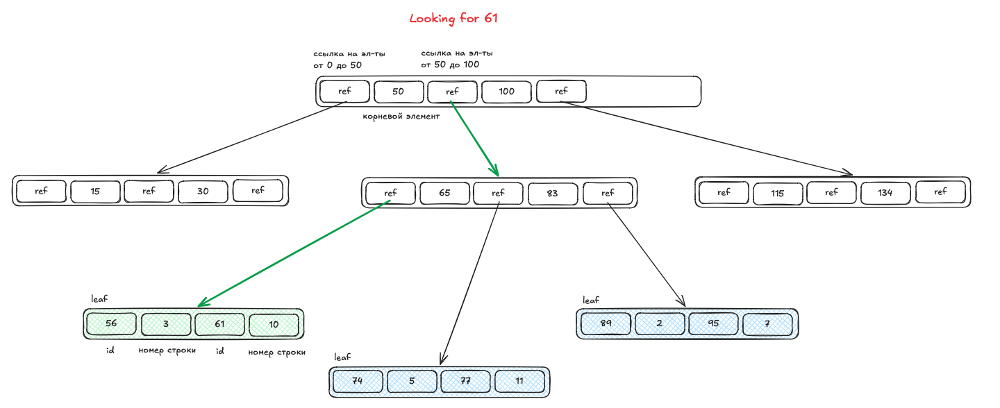
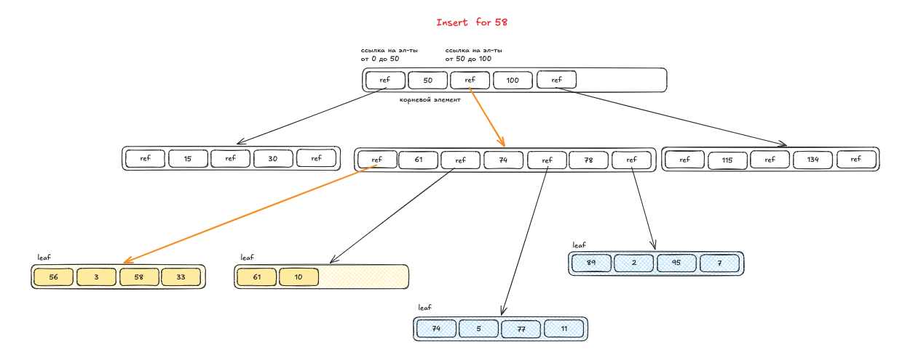

# Индексы

**Индекс** - структура данных, кооторая хранит информацию для поиска в удобном виде. 

Наличие индекса у записи замедляет запись в БД, но ускоряют чтение!

Виды:

* **Кластеризованный** - индекс диктует в каком порядке будут хранятся данные в файлы.

* **Некластерный**

или 

Индекс может быть **плотный** (dense) и **разряженный** (sparse). Плотный хранит запись 1 к 1. Разряженный - диапазоны.  

## Популярные индексы (и с какими операциями они хорошо работают)

- hash индекс - =
- b tree - = <>  `IN, BETWEEN, like 'foo%'`
- b+ tree = 
- GIST - хорошо подходит для геометрических данных
- GIN - полнотекстовый индекс
- BRIN - по ключу храняться только минимальное и максимальное значение блока. подходит для данных, которые коррелируют с последовательностью хранения на диске. например, отсечки в 10 секунд
- embedibgs

## B-tree

#### Поиск

#### Вставка

## Селективность индексов

Селективность индекса - это как часто данный индекс встречается в данных. Например, пол встречается чаще, имя чуть реже, а ID вообще один раз.

Чем меньше селективность индекса, тем быстрее будет поиск.

## Составной индекс

Правило эффективности - индекс эффективен до первого неравенства. 

 
   

[>>> Назад <<<](../README.md)