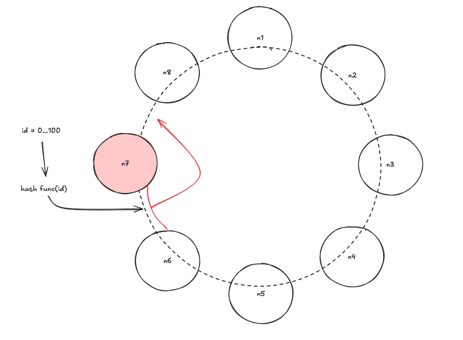

# Шардирование

## Что это такое?

Метод масштабирования баз данных, при котором большая таблица или вся база данных разбивается на более мелкие автономные части, называемые шардами.  

Шардируются таблицы, а не вся база.

**Плюсы:**
1. Увеличили производительность масштабируемость
2. Увиличили производительность на запись
3. Увиличить доступность данных

**Минусы:**
1. Сложность чтения
2. Сложность координирования
3. Write Skew / Hot Spot - когда один шард "перегрет"

##  Sharding Scheme

1. **Самое простое шардирование**
```
id % n = ...
```

Это тоже самое, что и round robin!

Проблемы подхода:
- Хэш функция должна распределять равномерно между нодами
- Решардинг

Решается введением виртуальных бакетов.

2. **Range based sharding**

Делим по диапазону значений. 

Проблема подхода:
- Сложно понять сколько точно данных будет.


3. **Шардинг по атрибуту**

Делим по определенному атрибуту, например, шардинг по стране. Проблема HotSpot. Важно выбрать правильно параметр.


4. **Dynamo**

Представляет из себя кольцо из нод. Если одна из нод выходит из строя, тогда все ее данные перекидываются на следующий шард.

Также могут быть виртуальные ноды, которые представленны меньшим количеством физических нод.




## Routing Layer

Это программный уровень, который определяет в какой шард будут уходить данные.

1. Клиент

2. Middle Layer (баунсер)

3. Centralized - Decentralized solution (etcd, zookeeper, ..)

4. Gossip протокол - отправляем запрос в любой шард, а он уже сам понимает куда надо рероутить запрос.


## Миграция данных. Этапы

1. Double Write пишем данные и в новую и в старую конфигурации.
2. Backfill - джоба, которые убирает старые данные и кладет в новые
3. Verification - убеждаемся, что данные распределены корректно
4. Switch over - переключаемся на новые шарды